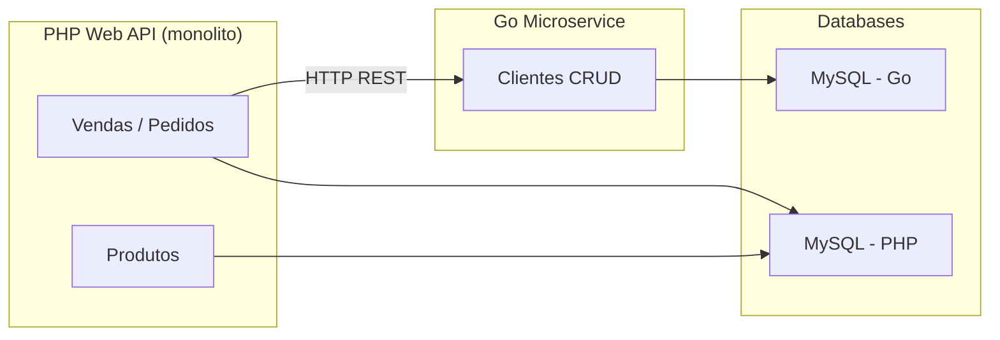
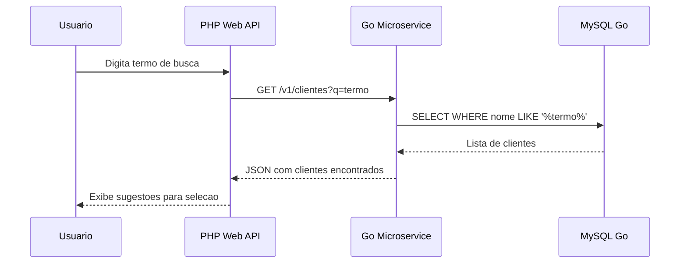
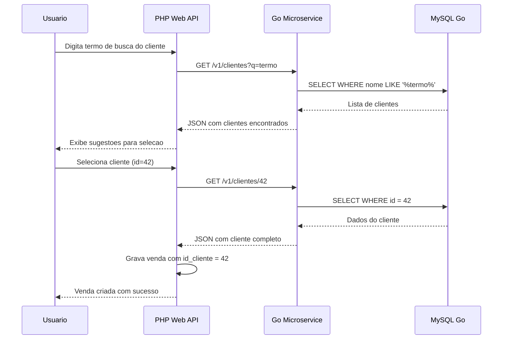
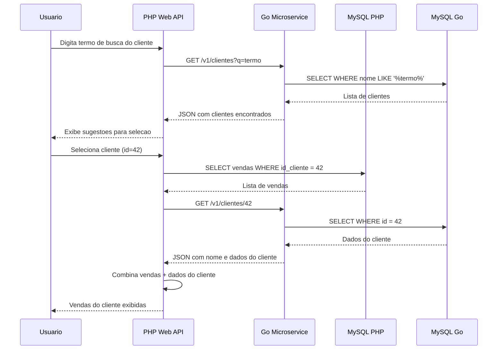
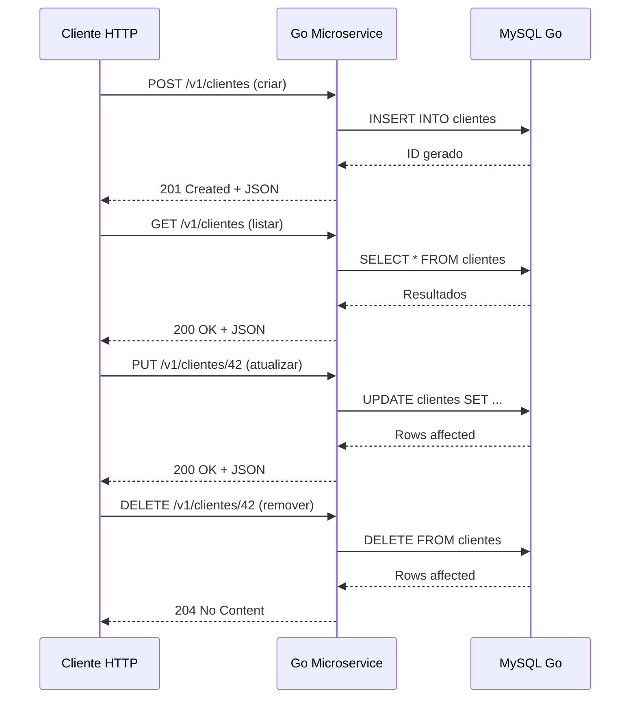

# Módulo 03: Decomposição de Domínio em Microsserviço

Projeto educacional que demonstra a integracao entre uma API monolitica em PHP e um microsservico em Go, simulando um cenario real de decomposicao de dominio.

---

## Objetivo

No modulo anterior (modulo 2), implementamos uma API de pedidos em PHP onde os dados do cliente -- como nome e documento -- eram armazenados diretamente no registro da venda. Essa abordagem funciona para um MVP, mas gera duplicacao de dados, inconsistencias entre vendas e impede a evolucao independente do cadastro de clientes.

Neste modulo, extraimos o dominio de **Clientes** para um microsservico Go dedicado. A API PHP passa a gravar apenas o `id_cliente` na venda e consome o microsservico para todas as operacoes de consulta e manutencao de clientes -- incluindo busca por termo (lookup), carregamento por ID e filtro de vendas por cliente.

### Beneficios

- **Dominio isolado** -- o cadastro de clientes evolui, escala e deploya independentemente
- **Fonte unica de verdade** -- elimina duplicacao de dados de cliente entre tabelas
- **Tecnologia adequada** -- Go oferece alta performance e baixo consumo de recursos para um servico de consulta intensiva
- **Contrato claro** -- a comunicacao via REST com JSON forca um contrato explicito entre os sistemas

---

## Arquitetura



A API PHP mantem seu banco MySQL proprio para pedidos e produtos. O microsservico Go possui seu banco isolado para clientes. A comunicacao entre os dois e feita via HTTP REST -- sem acoplamento a nivel de banco de dados.

---

## Fluxos Principais

### Busca de clientes por termo (autocomplete na venda)

Quando o usuario esta criando uma venda e digita parte do nome do cliente, a API PHP consulta o microsservico Go para exibir sugestoes.



### Criacao de venda com vinculo de cliente (lookup + selecao)

Fluxo completo: o usuario busca o cliente por termo, seleciona da lista retornada, a API PHP carrega os dados completos e grava a venda vinculada ao ID do cliente.



### Filtro de vendas por cliente (lookup + listagem)

O usuario busca o cliente por termo, seleciona da lista e a API PHP filtra as vendas vinculadas ao ID daquele cliente.



### CRUD de clientes no microsservico

O microsservico Go expoe um CRUD completo. O cadastro pode ser acessado tanto pela API PHP quanto diretamente.



---

## Estrutura do Repositorio

```
devpool-base-web-api/
├── golang-web-api/          # Microsservico Go -- CRUD de clientes
│   ├── cmd/                 # Ponto de entrada da aplicacao
│   ├── internal/            # Camadas DDD (domain, app, infrastructure, presentation)
│   ├── scripts_db/          # Scripts DDL do banco
│   ├── docs/                # Collection Bruno para testes de API
│   ├── docker-compose.yml   # MySQL do microsservico
│   ├── Makefile             # Comandos de desenvolvimento
│   └── README.md            # Setup, arquitetura DDD e testes
│
├── php-web-api/             # API PHP -- pedidos, produtos e integracao com clientes
│   └── README.md            # Setup e documentacao da API PHP
│
└── README.md                # Este arquivo -- visao geral e arquitetura
```

---

## Setup

Cada subprojeto possui seu proprio ambiente, dependencias e instrucoes de execucao:

| Subprojeto | Stack | Documentacao |
|------------|-------|--------------|
| **golang-web-api** | Go 1.24+, MySQL 8, Docker | [golang-web-api/README.md](golang-web-api/README.md) |
| **php-web-api** | PHP, MySQL, Docker | [php-web-api/README.md](php-web-api/README.md) |

---

## Comunicacao entre os servicos

| Origem | Destino | Metodo | Endpoint | Descricao |
|--------|---------|--------|----------|-----------|
| PHP API | Go Microservice | `GET` | `/v1/clientes?q={termo}` | Busca clientes por nome (autocomplete) |
| PHP API | Go Microservice | `GET` | `/v1/clientes/{id}` | Carrega dados completos do cliente |
| PHP API | Go Microservice | `POST` | `/v1/clientes` | Cadastra novo cliente |
| PHP API | Go Microservice | `PUT` | `/v1/clientes/{id}` | Atualiza dados do cliente |
| PHP API | Go Microservice | `DELETE` | `/v1/clientes/{id}` | Remove cliente |
