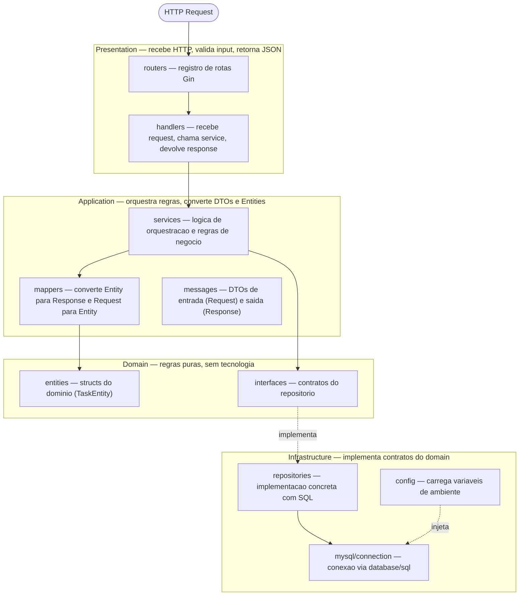
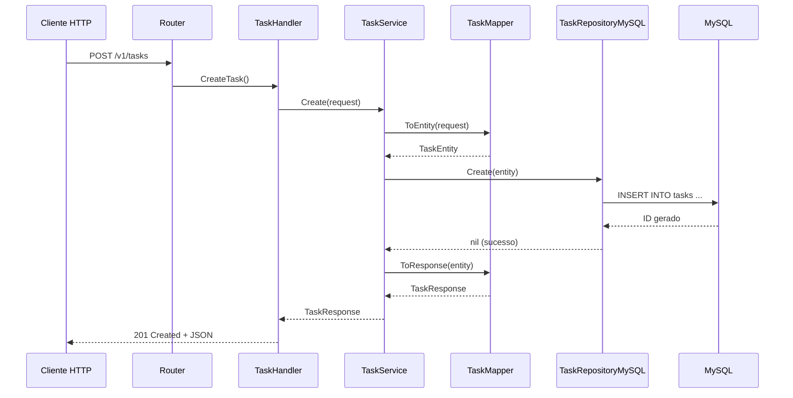

# devpool-base-web-api

Chassi educacional em Go para profissionais de outras areas que estao migrando para a linguagem. Baseado no chassi corporativo Bling, porem sem dependencias internas -- tudo aqui e publico e reproduzivel.

---

## Setup Rapido

### Pre-requisitos

- [Go 1.24+](https://go.dev/doc/install)
- [Docker](https://docs.docker.com/get-docker/) e Docker Compose
- Um editor com suporte a Go (VS Code com extensao Go, ou GoLand)

### 1. Clone o repositorio

```bash
git clone <url-do-repo>
cd devpool-base-web-api
```

### 2. Inicialize o ambiente de desenvolvimento

```bash
make dev-init
```

Isso ira:
- Subir o container MySQL via Docker Compose
- Copiar o `.env` de exemplo
- Baixar as dependencias Go
- Criar a tabela `tasks` no banco

### 3. Rode a aplicacao

```bash
make run
```

A API estara disponivel em `http://localhost:8080`.

### 4. Teste os endpoints

**Health check:**
```bash
curl http://localhost:8080/v1/health
```

**Criar uma task:**
```bash
curl -X POST http://localhost:8080/v1/tasks \
  -H "Content-Type: application/json" \
  -d '{"title": "Estudar Go", "description": "Completar o tour of Go"}'
```

**Listar tasks:**
```bash
curl http://localhost:8080/v1/tasks
```

Ou acesse a documentacao interativa em [http://localhost:8080/swagger/index.html](http://localhost:8080/swagger/index.html) para explorar e testar todos os endpoints via Swagger UI.

---

## Comandos do Makefile

| Comando | Descricao |
|---------|-----------|
| `make dev-init` | Sobe MySQL, copia `.env`, baixa dependencias e cria tabela |
| `make run` | Inicia a aplicacao via `go run` |
| `make build` | Compila o binario em `bin/web_api` |
| `make test` | Executa todos os testes (unitarios + e2e) |
| `make test-e2e` | Executa apenas os testes e2e (camada de presentation) |
| `make test-coverage` | Gera relatorio de cobertura em `coverage.html` |
| `make swagger` | Regenera a documentacao Swagger a partir das annotations |
| `make lint` | Executa o linter (`golangci-lint`) |
| `make up-db` | Sobe o container MySQL |
| `make down-db` | Para e remove os containers |
| `make clean` | Remove artefatos de build e cobertura |

---

## Arquitetura DDD Simplificada

Este projeto segue Domain-Driven Design com 4 camadas. Cada camada tem uma responsabilidade clara e nao pode "pular" camadas:



### Fluxo de uma requisicao POST /v1/tasks



### Por que separar em camadas?

- **Testabilidade**: o service pode ser testado com um mock do repository, sem MySQL real
- **Flexibilidade**: trocar MySQL por PostgreSQL exige mudar apenas a infrastructure
- **Clareza**: cada arquivo tem uma unica razao para mudar (Single Responsibility)

---

## Estrutura de Pastas

```
devpool-base-web-api/
  cmd/
    web_api/
      main.go                              # Ponto de entrada, DI manual
  internal/
    presentation/
      web_api/
        handlers/
          health_handler.go                # Health check (direto no DB, sem service)
          health_handler_test.go           # Testes e2e do HealthHandler
          task_handler.go                  # CRUD de Task (usa TaskService)
          task_handler_test.go             # Testes e2e do TaskHandler
          mocks_test.go                    # Mock do TaskServiceInterface (testes)
        routers/
          router.go                        # Registro de rotas Gin
          health_routes.go                 # Rotas /health, /livez, /readyz
          task_routes.go                   # Rotas CRUD /tasks
        web_api.go                         # Struct API
    app/
      interfaces/
        task_service_interface.go          # Contrato do servico
      services/
        task_service.go                    # Orquestracao de regras de negocio
        task_service_test.go               # Testes unitarios (table-driven)
      messages/
        task_messages.go                   # CreateTaskRequest, TaskResponse
      mappers/
        task_mapper.go                     # Entity <-> Response/Request
      mocks/
        task_repository_mock.go            # Mock manual do TaskRepository
    domain/
      entities/
        task_entity.go                     # TaskEntity (struct do dominio)
      interfaces/
        task_repository_interface.go       # Contrato do repositorio
    infrastructure/
      config/
        config.go                          # LoadConfig via env vars
      mysql/
        connection.go                      # Conexao MySQL via database/sql
        repositories/
          task_repository_mysql.go         # Implementacao concreta com SQL
  scripts_db/
    01-database.sql                   # DDL das tabela
  docs/
    swagger/                               # Swagger docs gerados pelo swaggo (make swagger)
  .github/
    envs/
      localhost.env                        # Variaveis de ambiente exemplo
  docker-compose.yml                       # Apenas MySQL
  Makefile                                 # Goals simplificados
  go.mod
  .gitignore
  README.md
```

---

## Testes

O projeto possui duas camadas de testes, ambas executaveis sem MySQL rodando:

### Testes unitarios (service layer)

Testam a logica de negocio isoladamente, usando mocks manuais do repository.

```bash
go test ./internal/app/... -v
```

Arquivo: `internal/app/services/task_service_test.go`

### Testes e2e (handler layer)

Testam o fluxo HTTP completo usando `httptest.NewRecorder` + Gin em modo teste. O handler recebe um mock do service (para TaskHandler) ou `sqlmock` (para HealthHandler), validando toda a cadeia HTTP sem dependencias externas.

```bash
make test-e2e
```

Arquivos:
- `internal/presentation/web_api/handlers/task_handler_test.go` -- 7 cenarios (create sucesso, JSON invalido, titulo vazio, erro do service; list sucesso, lista vazia, erro do service)
- `internal/presentation/web_api/handlers/health_handler_test.go` -- 5 cenarios (health ok/fail, livez, readyz ok/fail)

### Executar todos os testes

```bash
make test
```

### Cobertura

```bash
make test-coverage
# Abre coverage.html no browser
```

### Padroes utilizados

- **Table-driven tests**: cada cenario e um struct numa slice, trivial de estender
- **Mock manual com closures**: struct com campos de funcao, sem geradores de codigo
- **`sqlmock`**: simula `*sql.DB` para testar health checks sem MySQL real

---

## Exercicios

O projeto entrega apenas **Create** e **List**. Implemente o restante para praticar:

1. **GET /v1/tasks/:id** -- buscar uma task por ID
2. **PUT /v1/tasks/:id** -- atualizar titulo, descricao e status
3. **DELETE /v1/tasks/:id** -- remover uma task
4. **Validacao de status** -- aceitar apenas "pending", "in_progress" e "done"
5. **Paginacao** -- adicionar `?page=1&limit=10` no List
6. **Testes para os novos endpoints** -- manter a cobertura

Para cada exercicio, siga o fluxo completo pelas camadas:
`domain interface -> infrastructure repo -> app service -> presentation handler -> router`

---

## Variaveis de Ambiente

O arquivo `.env` e gerado automaticamente por `make dev-init` a partir de `.github/envs/localhost.env`.

| Variavel | Descricao | Default |
|----------|-----------|---------|
| `APP_NAME` | Nome da aplicacao | `devpool-base-web-api` |
| `API_PORT` | Porta HTTP do servidor | `8080` |
| `ENV` | Ambiente de execucao | `development` |
| `DB_HOST` | Host do MySQL | `localhost` |
| `DB_PORT` | Porta do MySQL | `3306` |
| `DB_USER` | Usuario do MySQL | `devpool` |
| `DB_PASSWORD` | Senha do MySQL | `devpool123` |
| `DB_NAME` | Nome do banco de dados | `devpool` |
| `DB_MAX_OPEN_CONNS` | Maximo de conexoes abertas | `10` |
| `DB_MAX_IDLE_CONNS` | Maximo de conexoes ociosas | `5` |

---

## Apendice: O que e Go?

Go (ou Golang) e uma linguagem de programacao criada pelo Google em 2009, projetada por Robert Griesemer, Rob Pike e Ken Thompson. Ela combina a eficiencia de linguagens compiladas com a simplicidade de linguagens de script.

**Onde Go e usado?** Docker, Kubernetes, Terraform, Prometheus, e boa parte da infraestrutura cloud moderna sao escritos em Go. Empresas como Google, Uber, Twitch e a propria Bling usam Go em producao.

**Por que Go?** Compilacao rapida, binario unico (sem runtime externo), concorrencia nativa (goroutines), tipagem estatica, garbage collector eficiente e uma stdlib extremamente rica.

---

## Apendice: Go Proverbs

Os [Go Proverbs](https://go-proverbs.github.io/) sao principios formulados por Rob Pike que capturam a filosofia da linguagem. Estes sao os mais relevantes para este projeto:

### "Clear is better than clever"
Go valoriza codigo legivel. Prefira ser explicito a ser esperto. Se alguem precisa parar para decifrar o que uma linha faz, reescreva.

### "Errors are values"
Em Go, erros nao sao excecoes -- sao valores retornados por funcoes. Isso forca o programador a lidar com erros imediatamente, no ponto onde ocorrem:
```go
result, err := doSomething()
if err != nil {
    return err // trate aqui, nao ignore
}
```

### "Don't just check errors, handle them gracefully"
Nao basta verificar `if err != nil`; de contexto ao erro usando `fmt.Errorf("failed to create task: %w", err)`. O `%w` envolve (wraps) o erro original, permitindo inspe-lo depois com `errors.Is` ou `errors.As`.

### "The bigger the interface, the weaker the abstraction"
Interfaces em Go devem ser pequenas. `TaskRepository` tem apenas 2 metodos. Isso facilita implementar, testar e trocar implementacoes.

### "A little copying is better than a little dependency"
Antes de importar uma biblioteca para uma funcao simples, considere copiar o codigo. Menos dependencias = menos risco de breaking changes.

### "Make the zero value useful"
Em Go, variaveis nao inicializadas tem um valor zero (0, "", nil, false). Projete structs para que o valor zero faca sentido. Um slice nil, por exemplo, funciona normalmente com `append`.

### "Gofmt's style is no one's favorite, yet gofmt is everyone's favorite"
`gofmt` formata o codigo automaticamente. Ninguem precisa discutir tabs vs spaces -- a ferramenta decide. Execute `gofmt -w .` ou configure seu editor para formatar ao salvar.

---

## Apendice: Conceitos Fundamentais (no contexto do projeto)

### Packages e Visibilidade
Go organiza codigo em **packages** (pastas). A regra de visibilidade e simples: **maiuscula = exportado (publico), minuscula = nao exportado (privado)**:
```go
type TaskEntity struct { ... }  // exportado -- outros packages podem usar
type taskHelper struct { ... }  // nao exportado -- visivel apenas dentro do package
```

### Structs e Metodos (Receivers)
Go nao tem classes. Structs sao tipos compostos; metodos sao funcoes com um **receiver**:
```go
type TaskService struct {
    repo TaskRepository
}

// (s *TaskService) e o receiver -- equivale ao "this" de outras linguagens.
// O asterisco (*) significa que recebemos um ponteiro, nao uma copia.
func (s *TaskService) Create(ctx context.Context, req CreateTaskRequest) (*TaskResponse, error) {
    // ...
}
```

### Interfaces (implicitas)
Em Go, interfaces sao satisfeitas **implicitamente**. Nao existe `implements`:
```go
type TaskRepository interface {
    Create(ctx context.Context, task *TaskEntity) error
    List(ctx context.Context) ([]TaskEntity, error)
}

// TaskRepositoryMySQL implementa TaskRepository automaticamente
// porque possui os mesmos metodos. Go verifica isso em tempo de compilacao.
type TaskRepositoryMySQL struct { db *sql.DB }
func (r *TaskRepositoryMySQL) Create(ctx context.Context, task *TaskEntity) error { ... }
func (r *TaskRepositoryMySQL) List(ctx context.Context) ([]TaskEntity, error) { ... }
```

O package `database/sql` e um otimo exemplo: `sql.Open` retorna `*sql.DB`, e o driver MySQL se registra via `init()` sem que voce precise saber os detalhes.

### Ponteiros
`*Config` significa "ponteiro para Config". Ponteiros permitem:
1. Modificar o valor original (nao uma copia)
2. Evitar copias desnecessarias de structs grandes
3. Representar ausencia com `nil`

```go
func LoadConfig() *Config {     // retorna ponteiro
    return &Config{...}         // & cria o ponteiro
}
```

### Error Handling
Go nao tem exceptions. Funcoes retornam `error` como ultimo valor:
```go
db, err := mysql.NewConnection(cfg)
if err != nil {
    slog.Error("falhou", "error", err)
    os.Exit(1)
}
```

### Goroutines e Channels
Uma **goroutine** e uma funcao executada de forma concorrente. Custa apenas ~2KB de stack (vs ~1MB de uma thread OS):
```go
go func() {
    server.ListenAndServe()  // roda em paralelo
}()
```

Um **channel** permite comunicacao entre goroutines:
```go
sigCh := make(chan os.Signal, 1)
signal.Notify(sigCh, syscall.SIGTERM, syscall.SIGINT)
<-sigCh  // bloqueia ate receber um sinal
```

### Context
`context.Context` carrega deadlines, cancelamentos e valores entre camadas. Sempre passe `ctx` como primeiro parametro:
```go
func (r *TaskRepositoryMySQL) Create(ctx context.Context, task *TaskEntity) error {
    _, err := r.db.ExecContext(ctx, query, ...)  // respeita o timeout do context
    return err
}
```

### Defer
`defer` agenda uma funcao para executar quando a funcao atual retornar. Ideal para cleanup:
```go
db, _ := mysql.NewConnection(cfg)
defer db.Close()  // sera chamado quando main() terminar, nao importa como
```

---

## Glossario

| Termo | Significado |
|-------|-------------|
| **Package** | Unidade de organizacao de codigo em Go (uma pasta) |
| **Struct** | Tipo composto que agrupa campos (equivalente a classe, sem heranca) |
| **Interface** | Contrato que define metodos; satisfeito implicitamente |
| **Receiver** | Parametro especial que torna uma funcao em metodo de um tipo |
| **Goroutine** | Funcao executada concorrentemente (~2KB de stack) |
| **Channel** | Mecanismo de comunicacao entre goroutines |
| **Context** | Carrega deadlines, cancelamentos e valores entre camadas |
| **Defer** | Agenda execucao de funcao para quando a funcao atual retornar |
| **DDD** | Domain-Driven Design -- organiza codigo ao redor do dominio de negocio |
| **DTO** | Data Transfer Object -- struct usada para transportar dados entre camadas |
| **DSN** | Data Source Name -- string de conexao ao banco (`user:pass@tcp(host)/db`) |
| **Graceful Shutdown** | Encerrar o servidor permitindo que requisicoes em andamento finalizem |

---

## Referencias e Documentacoes

- [Go Documentation](https://go.dev/doc/) -- documentacao oficial da linguagem
- [Effective Go](https://go.dev/doc/effective_go) -- guia de boas praticas
- [Go Proverbs](https://go-proverbs.github.io/) -- proverbios do Rob Pike
- [Go by Example](https://gobyexample.com/) -- exemplos praticos
- [A Tour of Go](https://go.dev/tour/) -- tour interativo oficial
- [Gin Web Framework](https://gin-gonic.com/docs/) -- documentacao do Gin
- [database/sql tutorial](https://go.dev/doc/database/) -- tutorial oficial de database/sql
- [go-sql-driver/mysql](https://github.com/go-sql-driver/mysql) -- driver MySQL
- [godotenv](https://github.com/joho/godotenv) -- carregamento de .env
- [MySQL 8 Reference](https://dev.mysql.com/doc/refman/8.0/en/) -- documentacao MySQL
- [Docker Docs](https://docs.docker.com/) -- documentacao Docker
- [Docker Compose](https://docs.docker.com/compose/) -- documentacao Docker Compose
- [swaggo/swag](https://github.com/swaggo/swag) -- gerador de Swagger docs a partir de annotations Go
- [gin-swagger](https://github.com/swaggo/gin-swagger) -- middleware Swagger UI para Gin
